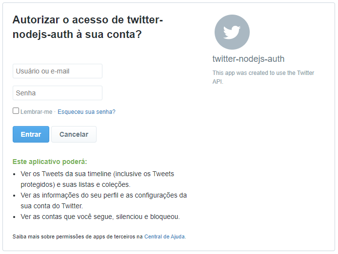

# twitter-auth

Prototipo de autenticação com NodeJS utilizando API do Twitter

## Autenticação via Twitter com NodeJS

## 🚀 Projeto

Este é um pequeno projeto para testar a implementação de autenticação através de logins em redes sociais. Para este protótipo escolhi a autenticação utilizando a API do Twitter.

Para a integração foi utilizado o módulo `passport-twitter` que permite uma criação de auteunticação simples entre NodeJS e o Twitter.

## 📦 Dependências

- express
- express-session
- passport
- passport-twitter
- dotenv

## 📄 Licença

Este projeto está sob a licença MIT - acesse [LICENSE](./LICENSE) para mais detalhes.

## 🧑🏻 Autor

Criado com 💙 por Gustavo Larsen
